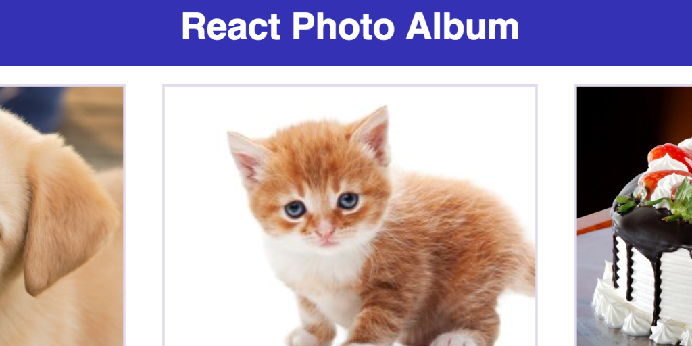

## React Photo Album

<kbd></kbd>

A simple photo album made with React. While the album/photo info is hard-coded, this is an example of setting state on the main parent component and filtering all the information necessary down to child components using only props and params.

- Built with [create-react-app](https://github.com/facebookincubator/create-react-app)
- Dependencies also include npm-run-all, react-router and Sass
- Scripts updated to include sass-watch and .scss to .css compilation
- Responsive design

Check out a working version [here](https://reactphotoalbum-danbuda.netlify.com/).
